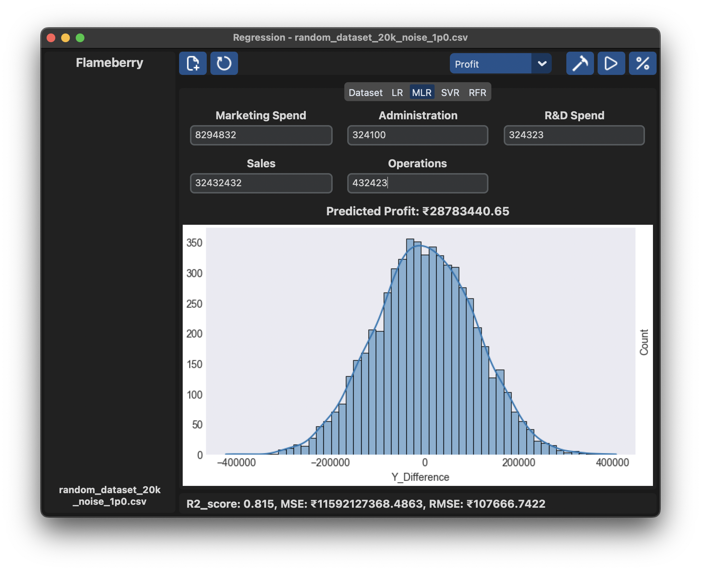

# Regression
This is the repo where you'll get the comparison of many regression methods by their accuracies, errors, etc.

The above is achieved by introducing you to an user interface where you can import any dataset you want and choose the column that you want to predict and predict it using various methods and comparing them by their accuracies, RMSEs and MSEs.

</img>

# Implemented Methods
1. Linear Regression
2. Multiple Linear Regression
3. Support Vector Regression
4. Random Forest Regression
5. Deep Neural Network Regression

 

# Installation using scripts

### <b> For Windows </b>
Run the batch script `scripts/setup_venv.bat` using the command prompt or by double clicking the file icon in file explorer.

### <b> For MacOS/Linux </b>
Run the shell script `scripts/setup_venv.sh` using the terminal by giving it the execute permission using '`chmod +x scripts/setup_venv.sh`'.

# Manual Installation
Below given modules should be installed for the code to work:
1. pandas
2. numpy
3. sklearn (scikit-learn)
4. matplotlib
5. seaborn
6. customtkinter
7. tensorflow (Only for Neural Network Regression)

 

# Dataset Generation
If you don't have any dataset to test the program on, you can use one of many programmatically generated datasets present in the `datasets/` folder.

Or you can run the `dataset_gen.py` file to generate a dataset, which can also be configured to generate a certain number of rows, certain column names, certain mathematical equations to be used to generate columns, etc.